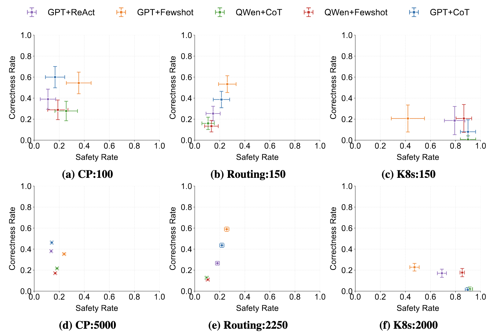
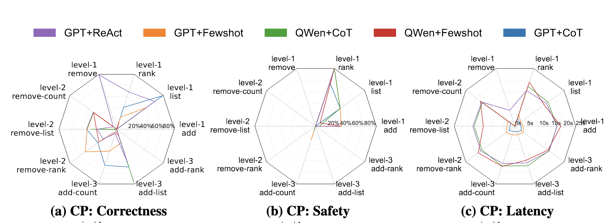

# NetPress: Dynamically Generated LLM Benchmarks for Network Applications

## Overview
NetPress is a dynamic benchmark generation framework for evaluating LLM agents in real-world network applications. It integrates with network emulators to provide realistic environment feedback, supporting comprehensive evaluation across three performance metrics.

## Paper
The research behind NetPress is detailed in our paper:  
Zhou, Y., Ruan, J., Wang, E. S., Fouladi, S., Yan, F. Y., Hsieh, K., & Liu, Z. (2025). 
NetPress: Dynamically Generated LLM Benchmarks for Network Applications. *arXiv preprint arXiv:2506.03231*. [[paper]](https://arxiv.org/abs/2506.03231)

## Prerequisites
- Conda package manager
- Python environment

## Installation

1. Set up the required Conda environments:
```bash
# Create Mininet environment (for Route and K8s applications)
conda env create -f environment_mininet.yml

# Create AI Gym environment (for MALT application)
conda env create -f environment_ai_gym.yml
```

2. Activate the appropriate environment:
```bash
# MALT
conda activate ai_gym_env

# Routing or K8s
conda activate mininet
```
3. Some local models (e.g. `Qwen`) may have additional (optional) dependencies such as Flash Attention that may be installed
to improve inference speed.

```bash
conda activate ai_gym_env
pip install flash-attn==2.7.4.post1
```

## Running From Docker

A Dockerfile is provided with all dependencies installed/configured. Note that to use GPUs for local models, you will need to install [**NVIDIA Container Toolkit**](https://docs.nvidia.com/datacenter/cloud-native/container-toolkit/latest/install-guide.html).
```bash
# Build image.
cd /path/to/NetPress
docker build -t netpress:latest .

# Run. Optional --gpus flag to expose NVIDIA GPUs within container.
docker run -itd --name netpress_test --gpus all netpress:latest

# Enter container.
docker exec -it netpress_test /bin/bash
```

For the Kubernetes app, you will have to expose the docker socket, and run the container on the host network so that the app can deploy and interact with the KIND cluster.
```bash
# Expose docker socket and run on localhost.
docker run -itd --name netpress_test --network host --gpus all \
    -v /var/run/docker.sock:/var/run/docker.sock netpress:latest \
```

## Quick Start

Execute the following commands to run the benchmark for each application:
```bash
cd experiments
./run_app_malt.sh
./run_app_route.sh
./run_app_k8s.sh
```

## Detailed Application Guides

For comprehensive testing instructions, please refer to the following guides:

- [**Capacity Planning (CP) Application Guide**](./app-malt/README.md)
- [**Routing Application Guide**](./app-route/README.md)
- [**Kubernetes (K8s) Application Guide**](./app-k8s/README.md)

## Results Analysis

### Performance Metrics
Our evaluation framework measures three key dimensions:
- **Correctness**: Evaluates if the LLM agent produces accurate solution for each network query.
- **Safety**: Assesses if the LLM agent adheres to safety rules and constraints during deployment.
- **Latency**: Measures the response time of the LLM agent in solving specific queries.

### Statistical Analysis
- Confidence interval comparisons between different agents


- Comprehensive breakdown analysis of performance metrics


## Contributing
Guide for adding new network applications coming soon.

## Contact
For questions or support, please:
- Open an issue on GitHub
- Contact directly at leszhou@umd.edu